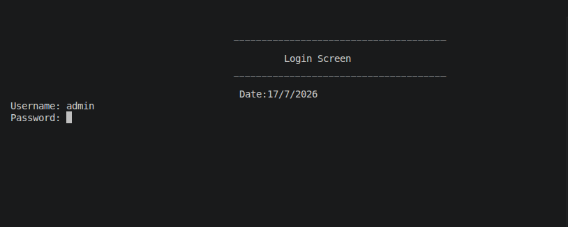
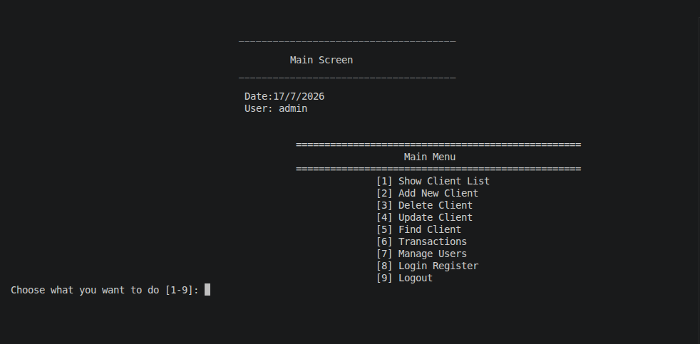
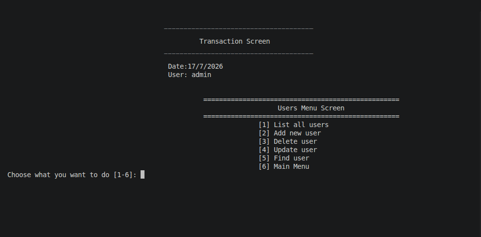

# Bank Management System

A simple banking management system built in C++ using Object-Oriented Programming (OOP) principles. It runs through a console-based interface and is designed to manage clients, users, and financial transactions such as deposits, withdrawals, and transfers. Data is stored in text files inside the Data folder.

## Features

- User login with username and password
- User permissions support including read, write, delete, update, user management, and transactions
- Client management:
  - View client list
  - Add a new client
  - Delete a client
  - Update client information
  - Find a client
- Financial transactions:
  - Deposit
  - Withdraw
  - View total balances
  - Transfer money between accounts
- Login and registration activity tracking
- Data persistence using text files instead of a database

## Default Login Credentials

As requested:

- Username: admin
- Password: 1234

## Project Structure

```text
Bank-Management-System_CPP/
├── Data/
│   ├── Clients.txt
│   ├── LoginRegister.txt
│   ├── TransfersLog.txt
│   └── Users.txt
├── src/
│   ├── Domain/
│   │   ├── BankClient.h
│   │   ├── LoginRegister.h
│   │   ├── Person.h
│   │   ├── SystemUser.h
│   │   └── TransferRecord.h
│   ├── Lib/
│   │   ├── Date.h
│   │   ├── InputValidator.h
│   │   ├── String.h
│   │   └── Util.h
│   ├── Repository/
│   │   ├── ClientRepository.h
│   │   ├── LoginRegisterRepository.h
│   │   ├── TransferRepository.h
│   │   └── UserRepository.h
│   ├── Screens/
│   │   ├── Client/
│   │   ├── Transactions/
│   │   ├── User/
│   │   ├── LoginRegisterScreen.h
│   │   ├── LoginScreen.h
│   │   ├── MainMenuScreen.h
│   │   └── Screen.h
│   ├── Services/
│   │   └── BankClientService.h
│   ├── Global.h
│   ├── main.cpp
│   └── main
└── README.md
```

## Project Components

- Domain:
  - Contains the core classes such as Client, User, and Transaction records.
- Lib:
  - Contains helper utilities such as input validation, date handling, and general functions.
- Repository:
  - Responsible for reading and writing data to the files inside the Data folder.
- Screens:
  - Contains the console screens for login, main menu, client management, transactions, and user management.
- Services:
  - Contains business logic such as executing financial transfers.
- Data:
  - Contains the text files that store users, clients, and history logs.

## How the Application Works

1. The program starts from main.cpp.
2. The login screen appears.
3. After a successful login, the main menu is displayed.
4. From the menu, the user can access:
   - Client management
   - Financial transactions
   - User management
   - Login history

---

## Screenshots

### Login Screen



### Main Menu



### Transactions Menu


### Users Menu



---

## Building and Running

### Build the project

```bash
g++ -std=c++17 -I src src/main.cpp -o src/main
```

### Run the project

```bash
./src/main
```

## Important Notes

- The system relies on text files in the Data folder and does not use a database.
- The project is designed as a console application and does not include a graphical interface.
- It can be extended later to include a real database or a GUI.

## Future Improvements

Possible enhancements for the project include:

- MySQL or SQLite database integration
- Graphical user interface using Qt or SFML
- Financial reporting and analytics
- Stronger error handling and security features
